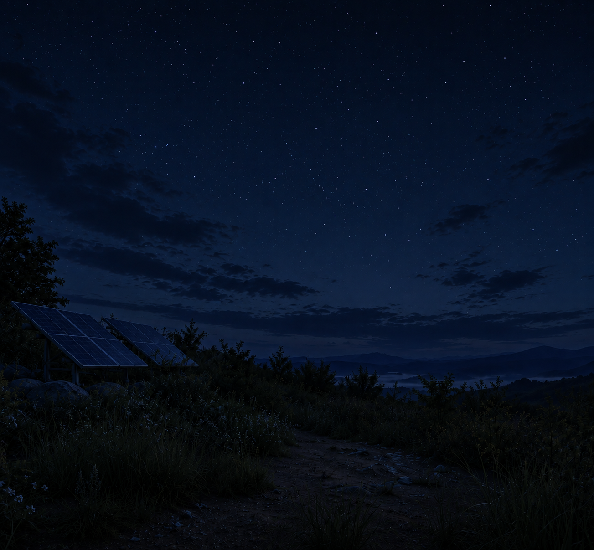

# Solar Panel Power Simulator

실시간 기상 데이터와 태양광 발전량 계산 공식을 결합한 **태양광 패널 발전량 예측 시뮬레이터**입니다.  
한국 기상청 API허브와 연동하여 현재 위치의 기온·습도·일사강도를 실시간으로 받아 예측 발전량을 계산합니다.

---

## 미리보기

| 새벽 | 아침 |
|------|------|
|  |  |

| 정오 | 저녁 | 밤 |
|------|------|-----|
|  |  |  |

> 현재 시각(KST)에 따라 배경 이미지와 UI 색상 테마가 자동으로 전환됩니다.

---

## 주요 기능

- **시간대별 배경 전환**: 새벽(0-5시) / 아침(6-10시) / 정오(11-15시) / 저녁(16-19시) / 밤(20-23시)
- **Glassmorphism UI**: 반투명 유리창 디자인, 시간대별 글자색 자동 조정
- **실시간 발전량 계산**: 기온·습도·일사강도·패널 면적을 이용한 물리 기반 계산식
- **생동감 있는 변동**: 매 1초마다 ±1.5% 오차를 적용하여 실시간 발전량 변동 표시
- **실제 기상 데이터 연동**: 기상청 API허브 `kma_sfctm2` (ASOS 지상관측) 사용
- **사용자 위치 자동 감지**: GPS + Reverse Geocoding으로 지역명 표시
- **패널 면적 조절**: 슬라이더로 1~100 m² 범위 실시간 조절
- **콘솔 디버그 모드**: `solarDebug.enable()` 명령어로 시간대 테스트 가능

---

## 🛠️ 기술 스택

| 구분 | 사용 기술 |
|------|-----------|
| 프론트엔드 | HTML5, Vanilla CSS, Vanilla JS |
| 백엔드 | Node.js, Express.js |
| 기상 API | [기상청 API허브](https://apihub.kma.go.kr) (typ01 ASOS 지상관측) |
| 위치 API | Browser Geolocation API + [BigDataCloud Reverse Geocoding](https://www.bigdatacloud.com) |
| 폰트 | Google Fonts (Outfit, Noto Sans KR) |

---

## 발전량 계산 공식

```
P [W] = I × A × η × (1 − γ × (T_cell − 20)) − β × (RH − RH_ref) × (I × A × η)
```

| 기호 | 설명 | 기본값 |
|------|------|--------|
| `I` | 일사강도 비율 (irradiance / 1000) | 기상청 실측 |
| `A` | 패널 면적 (m²) | 슬라이더 조절 |
| `η` | 모듈 효율 | 18% |
| `γ` | 온도 계수 | -0.4%/°C |
| `T_cell` | 모듈 온도 (NOCT 모델) | 기상청 기온 기반 |
| `β` | 습도 손실 계수 | 0.07%/% |
| `RH_ref` | 기준 습도 | 20% |

---

## 설치 및 실행

### 1. 저장소 클론

```bash
git clone https://github.com/rhktkd/Solar-Panel-school-Projact.git
cd Solar-Panel-school-Projact
```

### 2. 의존성 설치

```bash
npm install
```

### 3. 환경 변수 설정

```bash
cp .env.example .env
```

`.env` 파일을 열어 기상청 API허브 인증키를 입력합니다:

```env
KMA_AUTH_KEY=발급받은_인증키_입력
```

> **API 키 발급 방법**  
> 1. [기상청 API허브](https://apihub.kma.go.kr) 회원가입  
> 2. `지상관측 → 종관기상관측(ASOS)` API 신청  
> 3. 발급된 `authKey` 복사 후 `.env`에 붙여넣기

### 4. 서버 실행

```bash
node server.js
```

브라우저에서 **http://localhost:8000** 접속

---

## 프로젝트 구조

```
solar-panel-simulator/
├── index.html          # 메인 HTML (Glassmorphism 결과 패널)
├── index.css           # 스타일 (시간대별 테마, 반투명 효과)
├── index.js            # 프론트엔드 로직 (발전량 계산, 위치 추적, 디버그)
├── server.js           # Express 백엔드 (기상청 API 프록시)
├── package.json
├── .env.example        # 환경 변수 템플릿
└── src/
    ├── Dawn.png         # 새벽 배경 (00~05시)
    ├── Morning.png      # 아침 배경 (06~10시)
    ├── Noon.png         # 정오 배경 (11~15시)
    ├── Evening.png      # 저녁 배경 (16~19시)
    └── Night.png        # 밤 배경 (20~23시)
```

---

## 콘솔 디버그 모드

브라우저 개발자 도구(F12) → Console 탭에서 시간대를 자유롭게 조작할 수 있습니다.

```js
solarDebug.enable()          // 디버그 모드 진입 (명령어 목록 출력)

solarDebug.setHour(3)        // 새벽 배경으로 전환 (0~5시)
solarDebug.setHour(8)        // 아침 배경으로 전환 (6~10시)
solarDebug.setHour(13)       // 정오 배경으로 전환 (11~15시)
solarDebug.setHour(18)       // 저녁 배경으로 전환 (16~19시)
solarDebug.setHour(22)       // 밤 배경으로 전환 (20~23시)

solarDebug.setTime(14, 30)   // 14:30으로 직접 지정
solarDebug.next()            // 다음 시간대로 이동
solarDebug.prev()            // 이전 시간대로 이동
solarDebug.status()          // 현재 디버그 상태 확인
solarDebug.disable()         // 디버그 모드 종료 → 실제 시간 복귀
```

---

## 사용 API

| API | 용도 | 엔드포인트 |
|-----|------|-----------|
| 기상청 API허브 | 기온, 습도, 일사강도 | `apihub.kma.go.kr/api/typ01/url/kma_sfctm2.php` |
| BigDataCloud | GPS → 지역명 변환 | `api.bigdatacloud.net/data/reverse-geocode-client` |
| Browser Geolocation | 사용자 위치 | `navigator.geolocation` |

---

## 📄 라이선스

MIT License
